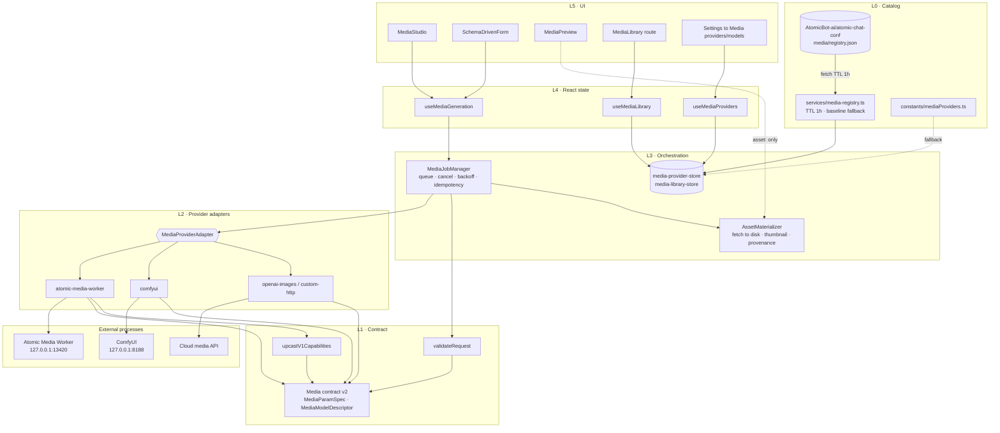

# Model-Agnostic Atomic Media Platform — Design and Implementation Plan

> **For agentic workers:** REQUIRED SUB-SKILL: Use `superpowers:subagent-driven-development` (recommended) or `superpowers:executing-plans` to implement this plan task-by-task. Steps use checkbox (`- [ ]`) syntax for tracking.

**Date:** 2026-09-08
**Branch:** `feature/atomic-code-foundation` (see §0.3 — this plan expects its own branch)
**Supersedes nothing.** Extends `docs/superpowers/plans/2026-08-24-atomic-media-workspace-implementation.md`.
**Predecessor spec:** `docs/superpowers/specs/2026-08-24-atomic-media-workspace-and-frameless-window-design.md`
**Handover context:** `Atomic-Chat-handover.md` (selective v2.0.32 update, Tasks 5–13 outstanding)

---

## Continuation prompt

> Implement the model-agnostic Atomic Media platform described in this document,
> in the repository and branch named above. Read this plan, the two predecessor
> Atomic Media documents, `AGENTS.md`, and `web-app/src/services/AGENTS.md`
> before editing. Resolve Task 0 (protected-surface reconciliation) with the user
> before writing any production code — the scope guard is currently red and no
> other task can be verified until that is settled. Then execute Tasks 1–17 in
> order, honouring the phase gates. Preserve the four pre-existing dirty paths
> from the selective-update handover. Commit each coherent phase, run the
> specified tests, and report the evidence listed in §12.

---

## Table of contents

- [§0 — Ground truth: what is actually in the tree today](#0--ground-truth-what-is-actually-in-the-tree-today)
- [§1 — What "model-agnostic" has to mean here](#1--what-model-agnostic-has-to-mean-here)
- [§2 — The thirteen couplings that must be broken](#2--the-thirteen-couplings-that-must-be-broken)
- [§3 — Target architecture](#3--target-architecture)
- [§4 — The contract, specified](#4--the-contract-specified)
- [§5 — Compatibility and migration](#5--compatibility-and-migration)
- [§6 — Protected-surface reconciliation](#6--protected-surface-reconciliation)
- [§7 — Implementation plan (Tasks 0–17)](#7--implementation-plan-tasks-017)
- [§8 — Testing strategy](#8--testing-strategy)
- [§9 — Risks and mitigations](#9--risks-and-mitigations)
- [§10 — Decisions to record as ADRs](#10--decisions-to-record-as-adrs)
- [§11 — Out of scope](#11--out-of-scope)
- [§12 — Required completion evidence](#12--required-completion-evidence)
- [§13 — Open decisions for the user](#13--open-decisions-for-the-user)

---

## §0 — Ground truth: what is actually in the tree today

Everything in this section was read out of the working tree on 2026-09-08. It is
recorded because the handover document is now stale, and because two of the
findings are blockers rather than background.

### 0.1 The Media surface as it exists

Eleven files, ~1,100 lines total:

| File | Lines | Role |
| --- | --- | --- |
| `web-app/src/routes/media.tsx` | 6 | TanStack file route `/media` → `MediaStudio` |
| `web-app/src/containers/media/MediaStudio.tsx` | 73 | Layout shell; owns `selectedModel`, wires hook → three children |
| `web-app/src/containers/media/MediaGenerationForm.tsx` | 489 | Mode tabs, model select, all parameter controls, submit |
| `web-app/src/containers/media/MediaPreview.tsx` | 54 | `` / `<video>` on `output_path` via `convertFileSrc` |
| `web-app/src/containers/media/MediaJobStatus.tsx` | 89 | Worker dot, progress bar, queue position, error banner |
| `web-app/src/hooks/useAtomicMediaJob.ts` | 142 | Health + capabilities fetch, submit, 1 s poll loop |
| `web-app/src/services/atomicMedia/client.ts` | 190 | Typed HTTP client, error normalisation |
| `web-app/src/services/atomicMedia/types.ts` | 138 | The entire wire contract |
| `MediaStudio.test.tsx`, `useAtomicMediaJob.test.tsx`, `client.test.ts` | ~500 | Test surface |

The Atomic Media Worker itself is **not in this repository**. A repository-wide
search for `13420` returns four files only: `client.ts`, `client.test.ts`, and
the two 2026-08-24 design/plan documents. There is no Rust-side supervisor, no
sidecar entry, and no bundle rule — the worker is an external localhost process
the user starts by hand.

### 0.2 Work has already moved toward capability-driven generation

Commit `a13b71a83` *"Make media generation capability-driven"* (2026-09-08) is
ahead of the HEAD recorded in the handover (`60bc3b914`). It rewrote
`MediaGenerationForm.tsx` (+544 lines changed) and extended `types.ts` (+81) to
introduce:

- `contract_version` on the capabilities payload, gated hard to `=== 1`
- `AtomicMediaModel` with `kinds`, `resolutions`, `frame_rule`, `defaults`,
  `ranges`, `supports`, `fitness`
- `AtomicMediaRecommendation` per kind
- `AtomicMediaDevice` with VRAM fields
- Model-driven control visibility (`shouldRenderSteps`, `shouldRenderFps`,
  `shouldRenderGuidance`), frame-rule quantisation (`nearestFrame`), and
  fitness-aware option labelling

**This is the right direction and this plan builds on it rather than replacing
it.** What commit `a13b71a83` achieved is *parameter-agnosticism within one
fixed schema*. What it did not, and could not, achieve is *provider-agnosticism*
or *open parameter vocabulary*. Those are §2's subject.

### 0.3 Blocker: the scope guard is red

`make verify` runs `test-selective-v2032`, which runs
`scripts/verify-selective-v2032.mjs`, which SHA-256-compares the eleven Atomic
Media files against `scripts/selective-v2032-protected.json`. Commit `a13b71a83`
modified eight of those eleven files without re-baselining the manifest. Current
state:

```
Protected file changed: web-app/src/containers/media/MediaGenerationForm.tsx
Protected file changed: web-app/src/containers/media/MediaStudio.test.tsx
Protected file changed: web-app/src/containers/media/MediaStudio.tsx
Protected file changed: web-app/src/hooks/useAtomicMediaJob.test.tsx
Protected file changed: web-app/src/hooks/useAtomicMediaJob.ts
Protected file changed: web-app/src/services/atomicMedia/client.test.ts
Protected file changed: web-app/src/services/atomicMedia/client.ts
Protected file changed: web-app/src/services/atomicMedia/types.ts
```

Only `MediaJobStatus.tsx`, `MediaPreview.tsx` and `routes/media.tsx` still match.

The guard was written to enforce the selective-update rule *"keep Atomic Media
byte-for-byte unchanged"*. That rule and this project are in direct conflict:
a model-agnostic Media platform cannot be built without editing these files.
§6 sets out the reconciliation, and Task 0 makes it the first thing done.

### 0.4 Blocker: CSP will silently break remote media

`src-tauri/tauri.conf.json` → `app.security.csp`:

```
"img-src":   "'self' asset: http://asset.localhost blob: data: https:",
"media-src": "'self' asset: http://asset.localhost blob: data: mediastream:",
```

`img-src` permits `https:`. **`media-src` does not.** `MediaPreview.toPreviewSrc`
(`MediaPreview.tsx:4-7`) passes any `https?:` URL straight through to
`<video src>`. So the moment a provider returns a remote video URL rather than a
local path, the element is blocked by CSP with no user-visible error — the
preview pane simply stays empty.

This is not a reason to widen `media-src`. It is a reason to adopt
**materialisation** as an architectural invariant (§3.4): every provider's output
is written to local disk before it is rendered, and the preview only ever sees
`asset:`. That is simultaneously the CSP-correct, privacy-preserving, offline-
correct, and library-compatible choice. §13 Q4 records the alternative.

### 0.5 Other pre-existing facts the plan depends on

- **Data root.** `%APPDATA%\Atomic Chat\data\` with siblings `models/`,
  `threads/`, `extensions/`, `logs/`, `store.json`, `mcp_config.json`
  (`DEVELOP.md` §"Where Atomic Chat stores data on Windows"). Relocatable via
  `Settings → Advanced → Change data folder location` (`change_app_data_folder`).
  A `media/` sibling is the only consistent choice; `AGENTS.md` §5 forbids
  inventing new data paths, so this must be derived from the same
  `AppConfiguration.data_folder` as everything else.
- **Remote-registry precedent.** `web-app/src/services/provider-registry.ts` +
  `stores/provider-registry-store.ts` + `constants/providers.ts` implement
  loader → 1 h `localStorage` cache → Zustand store → consumers, with a bundled
  baseline fallback and a `SUPPORTED_SCHEMA_VERSION` gate, sourced from
  `AtomicBot-ai/atomic-chat-conf`. `web-app/src/services/AGENTS.md` documents it
  in full. The media registry (Task 15) is a direct structural clone of this.
- **No Media ADR exists.** `docs/decisions/` has 215 records and not one mentions
  Media. `AGENTS.md` §6.8 requires non-trivial decisions to be recorded in the
  same session. §10 lists the six that this work owes.
- **No Media i18n.** `web-app/src/locales/` carries 14 locales
  (`cs de-DE en es fr id ja ko pl pt-BR ru vn zh-CN zh-TW`) and 17 namespaces.
  There is no `media.json`. Every string in the Media surface is hardcoded
  English, including the ones added by `a13b71a83`.
- **Vestigial model-specific constant.** `ATOMIC_MEDIA_DEFAULT_VIDEO_REQUEST`
  (`client.ts:11-23`) pins the Wan 2.2 baseline — `832×480`, 17 frames, 12 fps,
  10 steps, guidance 5.0. Since `a13b71a83` it is referenced by **nothing except
  its own test** (`client.test.ts:3,71,148`). It is dead shipped code that
  asserts a specific model's shape.

---

## §1 — What "model-agnostic" has to mean here

"Model-agnostic" is used loosely in most product conversations. For this
codebase it has to be given four separable, individually testable meanings,
because the current implementation satisfies roughly one and a half of them.

| # | Axis | Question it answers | Status today |
| --- | --- | --- | --- |
| **A** | **Parameter-agnostic** | Can a model expose a knob the UI has never heard of? | Partial — knobs are model-*driven* but the vocabulary is a closed struct |
| **B** | **Task-agnostic** | Can a model offer a task the UI has never heard of (audio, upscale, inpaint, 3D)? | No — closed 4-member union, 3 of which are wired |
| **C** | **Provider-agnostic** | Can a second engine — ComfyUI, a cloud API, a second worker — coexist with the first? | No — one hardcoded base URL, one singleton |
| **D** | **Lifecycle-agnostic** | Can models be discovered, installed, updated and removed from inside the app? | No — `installed` is displayed but never actionable |

The target state is all four, with the explicit non-goal that the **UI must never
learn a model's name**. The test for every design decision below is:

> *Could a brand-new model, exposing a brand-new task with a brand-new parameter,
> be made fully usable in Atomic Chat by editing a JSON manifest and restarting —
> with zero TypeScript changes and zero app release?*

If the answer is no, the abstraction is in the wrong place.

A second, equally important constraint pulls the other way and must not be lost:

> *The UI must not fabricate model capabilities.* — 2026-08-24 spec

So the system may not guess. Openness is achieved by **declaration**, never by
inference. A parameter exists in the UI because a provider declared it, with a
type, bounds and a default. Nothing is heuristic.

---

## §2 — The thirteen couplings that must be broken

Each entry cites the code that creates the coupling, states the failure it
produces, and names the task that removes it.

### C1 — Transport is a hardcoded singleton
`client.ts:9` `export const ATOMIC_MEDIA_BASE_URL = 'http://127.0.0.1:13420'`
`client.ts:190` `export const atomicMediaClient = new AtomicMediaClient()`
`useAtomicMediaJob.ts:25` defaults its client parameter to that singleton.

**Failure:** exactly one engine, at exactly one URL, speaking exactly one
protocol, can ever serve Media. A user running ComfyUI on `:8188` cannot use it.
Two GPUs served by two workers cannot both be used. There is no test seam for a
second provider because there is no concept of one.
→ **Tasks 3, 4, 5**

### C2 — Job taxonomy is a closed union
`types.ts:7-12` `AtomicMediaJobKind = 'text_to_image' | 'image_to_image' | 'text_to_video' | 'image_to_video'`

**Failure:** text-to-audio, text-to-speech, upscale, inpaint, outpaint, video
interpolation, image-to-3D, video extension, style transfer — every one of them
requires a frontend release. A "media platform" that can only ever do four
things is a video tool.
→ **Task 1**

### C3 — The mode tab list is hardcoded, and disagrees with the type
`MediaGenerationForm.tsx:23-32` — the `Mode` type is an `Extract<>` of three
kinds and `MODES` is a literal three-entry array.

**Failure:** `image_to_image` is representable in the contract, may be advertised
by the worker in `model.kinds`, and is **unreachable in the UI**. The tab strip
is a hand-maintained mirror of the capability payload that has already drifted.
→ **Task 11**

### C4 — Request parameters are a fixed struct
`types.ts:100-115` — `width`, `height`, `num_frames`, `steps`, `guidance_scale`,
`fps`, `seed`, `negative_prompt`, `input_image`, `preset`, `device`.

**Failure:** every model with a knob outside this list — scheduler/sampler
choice, CFG rescale, shift/sigma, denoise strength, motion-bucket id, LoRA stack
and weights, refiner pass, ControlNet conditioning, clip-skip, tiling, batch
count — is unusable at full fidelity. The parameters are a union of what the
first two models happened to need.
→ **Task 1**

### C5 — Each control is bespoke JSX bound to a named field
`MediaGenerationForm.tsx:278-455` — ~180 lines of eight hand-written control
blocks, each `id="media-<field>"`, each reading a specific typed property.

**Failure:** adding a parameter means editing a protected React file, adding
state, adding an effect branch, adding a submit-mapping line, and adding a test.
The cost of a new knob is a code review, not a manifest edit.
→ **Task 10**

### C6 — `supports` is a closed boolean set
`types.ts:74-78` `supports?: { negative_prompt, seed, input_image }`

**Failure:** capability advertisement does not scale — every new optional feature
is a new boolean, and booleans cannot carry bounds, defaults or enum members.
This is subsumed entirely by parameter declarations (§4.2): a parameter that is
declared is supported; one that is absent is not.
→ **Task 1**

### C7 — `frame_rule`, `resolutions` and `ranges` are three special cases of one idea
`types.ts:27-73` — a modulus/offset/min/max rule for frames, an enumerated
resolution list, and a min/max map for three named numeric fields.

**Failure:** three bespoke constraint mechanisms, each usable by exactly one
parameter shape. A model whose *steps* must be a multiple of 4, or whose *fps*
comes from a fixed set, cannot express that.
→ **Task 1** (unified `MediaParamSpec` with `min`/`max`/`step`/`modulus`/`options`)

### C8 — Model-specific defaults are compiled into the client
`client.ts:11-23` `ATOMIC_MEDIA_DEFAULT_VIDEO_REQUEST` — the Wan 2.2 baseline.

**Failure:** shipped code asserts one model's geometry. Now dead outside its own
test, so removal is free — but it is exactly the class of thing that must never
come back.
→ **Task 2** (delete, with the test)

### C9 — There is no model lifecycle
`MediaGenerationForm.tsx:38-40` `isSelectable()` filters on
`model.installed !== false`; `optionLabel()` surfaces fitness. Nothing anywhere
can *cause* a model to become installed.

**Failure:** a first-run user with a healthy worker and no models sees
*"No models available for this mode — Install a compatible model in Atomic Media
Worker, then refresh"* and has no in-app path forward. Compare the LLM side,
which has a full Hub, download manager, and progress UI.
→ **Tasks 12, 15**

### C10 — Jobs are ephemeral React state
`useAtomicMediaJob.ts:33` `const [job, setJob] = useState<...>(null)` — one job,
in component state, lost on unmount.

**Failure:** navigate to Chat and back mid-render and the job is gone from the UI
while still running on the GPU. No history, no gallery, no re-run, no
"what settings produced this?", no comparison between two generations. Every
other workspace in the app persists its work; Media does not.
→ **Tasks 7, 8, 13**

### C11 — Cancellation is a lie
`useAtomicMediaJob.ts:39-44` `cancelPolling()` clears a `setTimeout`. The worker
is never told.

**Failure:** "cancel" stops the UI from watching a job that continues to occupy
the GPU for minutes. On a 24 GB card a mistaken 121-frame submission blocks every
subsequent job with no recovery short of killing the worker.
→ **Tasks 3, 7**

### C12 — Polling is fixed-rate and unbounded
`useAtomicMediaJob.ts:26` `pollIntervalMs = 1000`; `schedulePoll` re-arms on error
forever (`useAtomicMediaJob.ts:89-92`).

**Failure:** a 1 s poll for a 20-minute video job is ~1,200 needless round trips;
an unreachable worker produces an infinite error loop that sets state on every
tick. No backoff, no ceiling, no give-up, no streaming alternative.
→ **Task 7**

### C13 — The surface is monolingual
No `media.json` in any of the 14 locale folders; every string is inline English.

**Failure:** Media is the only workspace that cannot be translated. The selective
v2.0.32 handover explicitly commits to preserving all languages; shipping a
platform-scale English-only surface walks that back.
→ **Task 14**

---

## §3 — Target architecture

### 3.1 Layer diagram



### 3.2 The seam, stated precisely

There is exactly one seam, and it is `MediaProviderAdapter`. Above it, nothing
knows a URL, a protocol, an auth scheme, or a vendor payload shape. Below it,
nothing knows React, routing, or the asset library.

Everything a provider can say about itself arrives as **data conforming to the
v2 contract**, never as a code branch. If a task requires `if (provider.id ===
'comfyui')` anywhere in L3–L5, the contract is missing a field and the fix is to
add the field, not the branch.

### 3.3 Why an adapter layer rather than "make the worker do it"

The Atomic Media Worker is external, unversioned relative to the app, and owned
outside this repository. Three consequences:

1. **The app cannot require a worker change to ship a feature.** The v1→v2
   upcaster (§5.1) exists precisely so that the entire platform lands against
   today's unmodified worker.
2. **The worker is not the only plausible engine.** ComfyUI is the de-facto
   local standard and already appears as a `backend` value in the existing test
   fixture (`MediaStudio.test.tsx:19`, `backend: 'comfyui'`). Routing it through
   the worker as a proxy would put protocol translation in a process this repo
   does not control.
3. **A second adapter is the only honest proof the abstraction works.** Task 5
   exists for that reason and should not be deferred; an interface with one
   implementation is a guess.

### 3.4 Materialisation is an invariant

> Every job output is written to the local media store before any UI element
> references it, and UI elements reference it only by local path through
> `convertFileSrc`.

Consequences, all of them desirable:

- CSP `media-src` needs no widening (§0.4).
- Cloud outputs — which are usually short-lived signed URLs — survive.
- The library, thumbnails, provenance and re-run all have something to point at.
- Offline review works.
- A provider that returns bytes, a path, or a URL is normalised at L2 and the
  difference stops there.

### 3.5 What deliberately does *not* change

- `/media` remains the route; `MediaStudio` remains its component.
- The three-pane layout — settings left, preview and status right — is preserved
  exactly; it was approved product direction and is not reopened here.
- Chat, Agent, provider selection, the `:1337/v1` OpenAI-compatible surface, and
  the Windows frameless shell are untouched.
- No new top-level folder, config file, or runtime dependency (`AGENTS.md` §6.6)
  without the explicit approval called for in §13.

---

## §4 — The contract, specified

New location: `web-app/src/services/media/contract/`. The existing
`web-app/src/services/atomicMedia/` becomes the **worker adapter's** private
implementation detail (§7 Task 3) rather than the app-wide contract.

### 4.1 Identity and tasks

```ts
/** Open vocabulary. Well-known ids are constants, not a closed union. */
export type MediaTaskId = string

export const MEDIA_TASK = {
  TEXT_TO_IMAGE: 'text_to_image',
  IMAGE_TO_IMAGE: 'image_to_image',
  TEXT_TO_VIDEO: 'text_to_video',
  IMAGE_TO_VIDEO: 'image_to_video',
  TEXT_TO_AUDIO: 'text_to_audio',
  TEXT_TO_SPEECH: 'text_to_speech',
  UPSCALE: 'upscale',
  INPAINT: 'inpaint',
  OUTPAINT: 'outpaint',
  INTERPOLATE: 'interpolate',
} as const satisfies Record<string, MediaTaskId>

/** Presentation only. Unknown tasks fall back to id-as-label + generic icon. */
export type MediaTaskPresentation = {
  id: MediaTaskId
  label_key?: string   // i18n key, e.g. 'media:task.text_to_video'
  label?: string       // provider-supplied fallback when no key is known
  icon?: string
  order?: number
  output_media_type: 'image' | 'video' | 'audio' | 'model3d' | 'unknown'
}
```

**Why a `string` and not a union.** The union is what makes C2 a release-blocking
coupling. Openness costs one thing — the compiler can no longer exhaustively
check a `switch` on task — and buys the platform property in §1. The cost is paid
back by making unknown tasks *render*, not *crash*: `output_media_type` is the
only field the UI branches on, and it has an `'unknown'` member that renders a
download affordance rather than a player.

### 4.2 Parameter specification — the keystone type

```ts
export type MediaParamType =
  | 'string'      // single-line
  | 'text'        // multi-line (prompt, negative prompt)
  | 'int'
  | 'float'
  | 'bool'
  | 'enum'
  | 'seed'        // int + "randomise" affordance + empty = random
  | 'resolution'  // paired w/h, rendered as one control
  | 'image_ref'   // local path or library asset id
  | 'audio_ref'
  | 'stringlist'  // e.g. LoRA names

export type MediaParamSpec = {
  /** Wire name. Sent verbatim in the request params bag. */
  id: string

  type: MediaParamType

  /** i18n key preferred; `label` is the provider's untranslated fallback. */
  label_key?: string
  label?: string
  help_key?: string
  help?: string

  /** Layout. Unknown groups render after known ones, alphabetically. */
  group?: 'core' | 'output' | 'sampling' | 'motion' | 'advanced' | string
  order?: number
  advanced?: boolean          // collapsed behind "Advanced" by default

  required?: boolean
  default?: unknown

  // Numeric constraints — apply to int/float/seed
  min?: number
  max?: number
  step?: number
  /** Generalises the old frame_rule: value must satisfy v % modulus === offset */
  modulus?: { modulus: number; offset: number }

  // enum / resolution
  options?: Array<{
    value: string | number
    label?: string
    label_key?: string
    /** For type 'resolution' only. */
    width?: number
    height?: number
  }>

  // string / text
  max_length?: number
  placeholder_key?: string

  // image_ref / audio_ref
  accept?: string[]           // mime types

  /** Conditional visibility. All clauses must hold. */
  depends_on?: Array<{
    param: string
    equals?: unknown
    in?: unknown[]
    truthy?: boolean
  }>

  /** Cosmetic hint only; never load-bearing. */
  widget?: 'slider' | 'input' | 'select' | 'radio' | 'switch' | 'textarea'
}
```

This single type subsumes C4, C6 and C7:

| v1 concept | v2 expression |
| --- | --- |
| `supports.negative_prompt: true` | a `text` param with `id: 'negative_prompt'` exists |
| `supports.seed: true` | a `seed` param with `id: 'seed'` exists |
| `supports.input_image: true` | an `image_ref` param with `id: 'input_image'` exists |
| `resolutions: [{w,h}, …]` | one `resolution` param whose `options` carry `width`/`height` |
| `frame_rule: {modulus,offset,min,max}` | an `int` param with `min`, `max`, `modulus` |
| `ranges.steps: {min,max}` | an `int` param `id: 'steps'` with `min`, `max` |
| `defaults.fps: 12` | that param's `default` |

### 4.3 Models and providers

```ts
export type MediaFitnessStatus =
  | 'recommended' | 'runnable' | 'degraded' | 'unsupported'

export type MediaFitness = {
  status: MediaFitnessStatus
  reason_key?: string
  reason?: string
  required_device?: string | null
  min_vram_mb?: number
  notes?: string[]
}

export type MediaInstallState = {
  installed: boolean
  installable: boolean          // provider exposes an install path
  size_bytes?: number
  version?: string
  update_available?: boolean
  source?: { kind: 'huggingface' | 'url' | 'provider'; ref?: string }
}

export type MediaModelDescriptor = {
  /** Globally unique, provider-qualified: `${provider_id}:${local_id}` */
  id: string
  provider_id: string
  local_id: string

  label: string
  description_key?: string
  family?: string               // e.g. 'wan2.2', 'flux', 'sdxl' — display only
  repo?: string

  tasks: MediaTaskId[]
  /** Per-task parameter schema. Key must appear in `tasks`. */
  params: Record<MediaTaskId, MediaParamSpec[]>

  install?: MediaInstallState
  fitness?: MediaFitness
  license?: { id?: string; url?: string; gated?: boolean }
  outputs?: Partial<Record<MediaTaskId, {
    media_type: MediaTaskPresentation['output_media_type']
    mime?: string[]
  }>>
  /** Non-local providers only. Display-only; never used to gate submission. */
  cost?: { unit: 'credit' | 'usd'; per_job?: number; note_key?: string }
}

export type MediaDeviceDescriptor = {
  id: string
  label: string
  backend?: string
  vram_total_mb?: number
  vram_free_mb?: number
}

export type MediaCapabilities = {
  contract_version: 2
  provider_id: string
  devices: MediaDeviceDescriptor[]
  models: MediaModelDescriptor[]
  tasks?: MediaTaskPresentation[]      // presentation metadata for its tasks
  recommended?: Array<{ task: MediaTaskId; model_id: string }>
  features?: {
    cancel?: boolean
    progress?: boolean
    queue?: boolean
    events?: boolean                    // SSE/WS streaming available
    install?: boolean
    batch?: boolean
  }
}
```

Two deliberate choices worth flagging:

- **`id` is provider-qualified.** Two providers may both expose `sdxl-base`.
  Unqualified ids make the selection state ambiguous the moment a second provider
  exists, and that ambiguity is impossible to fix later without a migration.
- **`params` is keyed by task.** The same model frequently takes different knobs
  for `text_to_video` than for `image_to_video` (`strength`, `input_image`), so a
  single flat parameter list would force `depends_on` gymnastics on every entry.

### 4.4 Provider descriptor and adapter interface

```ts
export type MediaProviderKind = 'local_worker' | 'local_comfy' | 'remote_http'

export type MediaProviderDescriptor = {
  id: string
  label: string
  kind: MediaProviderKind
  adapter: 'atomic-media-worker' | 'comfyui' | 'openai-images' | 'custom-http'
  base_url?: string
  auth?: { type: 'none' | 'api_key' | 'bearer'; setting_key?: string }
  enabled: boolean
  origin: 'builtin' | 'registry' | 'user'
  /** Registry-supplied hints; adapters may ignore. */
  endpoints?: Partial<Record<'health' | 'capabilities' | 'jobs' | 'events', string>>
  order?: number
}

export type MediaProviderHealth = {
  state: 'online' | 'offline' | 'checking' | 'unauthorised'
  service?: string
  version?: string
  detail_key?: string
  detail?: string
}

export type NormalizedMediaRequest = {
  client_job_id: string          // ULID — idempotency key + local correlation
  provider_id: string
  model_id: string               // provider-qualified
  task: MediaTaskId
  params: Record<string, unknown>   // validated against MediaParamSpec[]
  device?: string
}

export type MediaJobState =
  | 'queued' | 'running' | 'succeeded' | 'failed' | 'cancelled'

export type MediaJobSnapshot = {
  client_job_id: string
  provider_job_id?: string
  provider_id: string
  state: MediaJobState
  progress?: number | null           // 0..100
  step?: { current: number; total: number } | null
  queue_position?: number | null
  eta_ms?: number | null
  outputs?: MediaOutputRef[]         // provider-native: path | url | bytes
  error?: { code: string; message: string; retryable: boolean } | null
  started_at?: number
  finished_at?: number
}

export type MediaOutputRef =
  | { kind: 'local_path'; path: string; mime?: string }
  | { kind: 'url'; url: string; mime?: string; expires_at?: number }
  | { kind: 'inline'; base64: string; mime: string }

export interface MediaProviderAdapter {
  readonly descriptor: MediaProviderDescriptor

  health(signal?: AbortSignal): Promise<MediaProviderHealth>
  capabilities(signal?: AbortSignal): Promise<MediaCapabilities>

  submit(req: NormalizedMediaRequest, signal?: AbortSignal): Promise<MediaJobSnapshot>
  poll(handle: Pick<MediaJobSnapshot, 'client_job_id' | 'provider_job_id'>,
       signal?: AbortSignal): Promise<MediaJobSnapshot>

  /** Optional. Presence must match capabilities.features.events. */
  subscribe?(handle: Pick<MediaJobSnapshot, 'client_job_id' | 'provider_job_id'>,
             onEvent: (snapshot: MediaJobSnapshot) => void): () => void

  /** Optional. Presence must match capabilities.features.cancel. */
  cancel?(handle: Pick<MediaJobSnapshot, 'client_job_id' | 'provider_job_id'>): Promise<void>

  /** Optional. Presence must match capabilities.features.install. */
  install?(modelId: string, onProgress: (p: { received: number; total?: number }) => void,
           signal?: AbortSignal): Promise<void>
  uninstall?(modelId: string): Promise<void>
}
```

Materialisation is **not** on the adapter: it is a single L3 service
(`AssetMaterializer`) that consumes `MediaOutputRef[]`, because the three
variants are exhaustive and the handling is identical for every provider.

### 4.5 Assets and provenance

```ts
export type MediaAsset = {
  asset_id: string              // ULID
  client_job_id: string
  media_type: 'image' | 'video' | 'audio' | 'model3d' | 'unknown'
  path: string                  // absolute, under <data_folder>/media/outputs/
  thumb_path?: string
  mime: string
  bytes: number
  width?: number
  height?: number
  duration_ms?: number
  created_at: number
  favourite?: boolean

  /** Everything needed to reproduce this exact output. */
  provenance: {
    provider_id: string
    model_id: string
    model_label: string
    task: MediaTaskId
    params: Record<string, unknown>
    resolved_seed?: number
    device?: string
    app_version: string
    contract_version: number
  }
}
```

`provenance` is what makes the library more than a folder of files: it powers
"re-run", "re-run with a new seed", "copy settings to form", and a truthful
answer to *"how did I make this?"* six weeks later.

**Storage layout**, derived from `AppConfiguration.data_folder` (never hardcoded):

```
<data_folder>/media/
  index.json          # MediaAsset[] — the library index
  outputs/<yyyy>/<mm>/<asset_id>.<ext>
  thumbs/<asset_id>.webp
  inputs/<asset_id>.<ext>      # user-supplied reference images, copied in
```

Factory reset and the uninstaller's "Delete app data" already operate on
`<data_folder>`, so this subtree inherits correct lifecycle semantics for free.
It must be explicitly added to the `DEVELOP.md` data-paths table (Task 16).

---

## §5 — Compatibility and migration

### 5.1 The v1 → v2 upcaster is the keystone

The single most important property of this plan: **it lands against today's
unmodified Atomic Media Worker.**

`upcastV1Capabilities(payload: AtomicMediaCapabilities): MediaCapabilities`
performs a total, lossless translation:

```
contract_version: 1                     → contract_version: 2
model.kinds                             → model.tasks
model.resolutions[]                     → params[task] += { id:'resolution', type:'resolution',
                                             group:'output', options: resolutions.map(...) }
model.frame_rule{modulus,offset,min,max}→ params[video tasks] += { id:'num_frames', type:'int',
                                             group:'motion', min, max, modulus:{modulus,offset} }
model.ranges.fps                        → params[video tasks] += { id:'fps', type:'int', group:'motion', min, max }
model.ranges.steps                      → params[task] += { id:'steps', type:'int', group:'sampling', min, max }
model.ranges.guidance_scale             → params[task] += { id:'guidance_scale', type:'float',
                                             group:'sampling', min, max, step:0.1 }
model.defaults.<k>                      → the matching param's `default`
model.supports.negative_prompt          → params[task] += { id:'negative_prompt', type:'text', group:'core' }
model.supports.seed                     → params[task] += { id:'seed', type:'seed', group:'advanced' }
model.supports.input_image              → params[i2v/i2i] += { id:'input_image', type:'image_ref',
                                             group:'core', required:true }
model.installed                         → install: { installed, installable:false }
model.fitness                           → fitness (1:1)
capabilities.devices                    → devices (1:1)
capabilities.recommended[].kind         → recommended[].task
(implicit)                              → features: { cancel:false, progress:true, queue:true,
                                             events:false, install:false, batch:false }
```

Every model always receives an implicit `prompt` param (`type: 'text'`,
`group: 'core'`, `required: true`) because v1 made it mandatory at the type
level (`AtomicMediaJobRequest.prompt: string`).

The reverse direction — `downcastV2Request(req): AtomicMediaJobRequest` — is the
worker adapter's serialiser: it pulls known ids out of the params bag back into
the flat v1 body, and drops the (necessarily empty, for a v1 worker) remainder.

**Result:** the day this ships, a user on the current worker sees an identical
form with identical controls, driven by a completely different mechanism. That
is the acceptance test for Task 2.

### 5.2 Version negotiation

```ts
export const MEDIA_CONTRACT_MIN_SUPPORTED = 1
export const MEDIA_CONTRACT_MAX_SUPPORTED = 2
```

| Worker reports | Behaviour |
| --- | --- |
| `1` | Upcast to v2. Full functionality within v1's expressive limits. |
| `2` | Used directly. |
| `> 2` | Refuse the payload; render "This provider needs a newer Atomic Chat", offer the updater. **Never** partially parse a future contract. |
| absent / malformed | Treat as offline-with-detail; render the existing "capabilities unavailable" panel. |

Note that the current gate is `capabilities?.contract_version === 1`
(`MediaGenerationForm.tsx:95`) — an exact-equality check that would reject a v2
worker. Replacing it with a range check is a prerequisite for ever shipping a v2
worker, independent of everything else here.

### 5.3 Data migration

None required. There is no persisted Media state today (C10), so the library
index is created empty on first run. `index.json` carries its own
`schema_version` from day one so that later shape changes have somewhere to hang.

### 5.4 Behavioural compatibility guarantees

These are regression-test obligations, not aspirations:

1. A user on the current worker sees the same controls, same defaults, same
   frame quantisation, same fitness labels, and the same submitted payload as
   before this work. (Task 2, Task 11.)
2. `/media` remains the route; the workspace switch is untouched.
3. Chat, Agent, provider selection and `:1337/v1` are byte-identical in
   behaviour.
4. Worker-offline rendering and the "Retry worker" affordance are preserved.

---

## §6 — Protected-surface reconciliation

This must be settled before any code is written, because until it is, `make
verify` cannot pass and therefore no task in §7 can be verified.

### 6.1 The conflict

`scripts/selective-v2032-protected.json` freezes eleven Media files by hash. It
was created to enforce a rule from a *different* project — the selective v2.0.32
backend port — whose scope decision reads *"Keep Atomic Media routes, components,
layout, and generation behavior exactly unchanged."* That rule was correct for
that project: it prevented an upstream merge from redesigning Media as a side
effect.

This project's entire purpose is to change eight of those eleven files. The guard
is doing its job by failing. What is wrong is that the guard now has two
incompatible readers.

### 6.2 Three options

| | Option A — Re-baseline | Option B — Narrow the guard | Option C — Freeze under, build over |
| --- | --- | --- | --- |
| **Mechanism** | Recompute all eleven hashes; the guard resumes protecting the *new* state | Drop the Media entries; keep the Atomic-Code absence checks and forbidden-text scan | Leave the eleven frozen; put the platform in new files and reduce the frozen ones to shims |
| **Protects against upstream re-merge** | Yes | No | Yes |
| **Allows this project** | Yes, with a re-baseline step per phase | Yes | Only partially — C3/C5/C11 live inside frozen files |
| **Honest about intent** | Yes | Loses the Media guarantee entirely | No — produces a shim layer whose only purpose is hash evasion |
| **Cost** | One manifest regen per phase gate, in the same commit | One-line change, permanent loss of protection | High structural cost, dishonest |

### 6.3 Recommendation

**Option A, with a rule.** Re-baseline the manifest, and add to
`scripts/verify-selective-v2032.mjs` a companion script
`scripts/rebaseline-selective-v2032.mjs` that regenerates the manifest, so that
re-baselining is an explicit, reviewable, single-purpose commit rather than a
hand-edited JSON blob.

The rule that keeps the guard meaningful:

> The protected manifest may only be re-baselined in a commit that changes
> *nothing else*, whose message begins `chore(guard): re-baseline`, and which
> cites the commit range whose Media changes it is accepting.

That preserves exactly the property the guard was built for — *an upstream merge
cannot silently alter Media* — while allowing deliberate, reviewed evolution.
Option B is what happens by accident if nobody decides; it should be chosen
explicitly or not at all.

This is §13 Q1 and is the one question that genuinely blocks the work.

---

## §7 — Implementation plan (Tasks 0–17)

**Global constraints** (in force for every task):

- Do only what the task says; no opportunistic refactors (`AGENTS.md` §6.1).
- Never fabricate backend behaviour; a parameter exists because a provider
  declared it (`AGENTS.md` §6.2).
- All new identifiers use `atomic` / Atomic Chat naming; no new `jan*`
  identifiers (`AGENTS.md` §4).
- No new top-level folder, config file, or runtime dependency without explicit
  approval (`AGENTS.md` §6.6) — see §13 Q5.
- Never commit unless explicitly asked (`AGENTS.md` §6.5); this plan's commit
  steps are *proposals* to be confirmed.
- Do not touch the four pre-existing dirty paths from the selective-update
  handover: `downloads/index.html`, `extensions/yarn.lock`,
  `src-tauri/icons/icon.png`, `web-app/src/containers/DownloadManegement.tsx`.
- Every task is test-first: write the failing test, run it, watch it fail for the
  right reason, then implement.

**Phase gates.** Do not begin a phase until the previous one's gate is green.

| Phase | Tasks | Gate |
| --- | --- | --- |
| 0 · Unblock | 0 | `make verify` green |
| 1 · Contract | 1–2 | Upcaster round-trip tests green; no UI change yet |
| 2 · Providers | 3–6 | Two adapters pass one shared conformance suite |
| 3 · Orchestration | 7–9 | Job manager + library unit tests green |
| 4 · UI | 10–14 | `make verify-fast` green; visual parity confirmed |
| 5 · Catalog | 15 | Registry loader tests green |
| 6 · Close-out | 16–17 | `make verify` green; ADRs written |

---

### Task 0: Reconcile the protected-surface guard

**Blocking. Do not start Task 1 until this is merged and `make verify` is green.**

**Files:**
- Create: `scripts/rebaseline-selective-v2032.mjs`
- Modify: `scripts/selective-v2032-protected.json`
- Modify: `tests/verify-selective-v2032.test.mjs`
- Modify: `Makefile` (add `rebaseline-selective-v2032` target)

**Interfaces:**
- Produces: a reproducible manifest regeneration path.
- Produces: a green `make verify` baseline for every later task.

- [ ] **Step 1: Get the §13 Q1 decision from the user in writing**

Do not guess. If the answer is Option B or C, stop and re-plan §7 — Option C in
particular invalidates Tasks 10 and 11 as written.

- [ ] **Step 2: Write a failing test for the re-baseline script**

In `tests/verify-selective-v2032.test.mjs`, add a fixture case: given a temp tree
whose protected file differs from the manifest, `rebaseline` rewrites the
manifest such that a subsequent `verifyTree` returns zero errors, and the
rewritten manifest keeps its keys sorted and its formatting stable.

- [ ] **Step 3: Run and confirm failure**

Run: `node --test tests/verify-selective-v2032.test.mjs`
Expected: FAIL — module not found.

- [ ] **Step 4: Implement `rebaseline-selective-v2032.mjs`**

Reuse `hashFile` from the verify script (export it). Accept `--root` and
`--protected` exactly as the verifier does. Write with sorted keys, two-space
indent, trailing newline. Refuse to run if any protected file is missing.

- [ ] **Step 5: Re-baseline the eight files changed by `a13b71a83`**

Run: `node scripts/rebaseline-selective-v2032.mjs`

- [ ] **Step 6: Verify the guard is green**

Run: `make test-selective-v2032`
Expected: PASS, `Selective v2.0.32 boundaries verified.`

- [ ] **Step 7: Commit — manifest change isolated**

Commit message:
```
chore(guard): re-baseline Atomic Media protected hashes

Accepts the Media changes in a13b71a83 (capability-driven generation).
Adds scripts/rebaseline-selective-v2032.mjs so future re-baselines are a
single reviewable step rather than a hand-edited manifest.
```

---

### Task 1: Introduce the v2 media contract

**Files:**
- Create: `web-app/src/services/media/contract/tasks.ts`
- Create: `web-app/src/services/media/contract/params.ts`
- Create: `web-app/src/services/media/contract/models.ts`
- Create: `web-app/src/services/media/contract/jobs.ts`
- Create: `web-app/src/services/media/contract/index.ts`
- Create: `web-app/src/services/media/contract/__tests__/params.test.ts`

**Interfaces:**
- Produces: every type in §4.1–§4.4.
- Produces: `validateParams(specs, values) => { ok, values, errors }` —
  coercion + bounds + modulus + enum membership + `depends_on` resolution.
- Consumes: nothing. This task adds no runtime behaviour and changes no UI.

- [ ] **Step 1: Write failing validation tests**

Cover, at minimum: numeric clamping to `min`/`max`; modulus quantisation
(`17` with `{modulus:4, offset:1}` stays `17`; `18` → `17`; `19` → `21`; ties
round down); enum rejection of a non-member; `required` with no value and no
default; `depends_on` hiding a param and thereby excluding it from output;
unknown-key passthrough being *dropped*, not forwarded; `seed` empty-string
meaning "random" rather than `0`.

- [ ] **Step 2: Run and confirm failure**

Run: `yarn workspace @janhq/web-app vitest run src/services/media/contract`
Expected: FAIL — module not found.

- [ ] **Step 3: Implement the types**

Types only — no I/O, no React, no imports from `@/services/atomicMedia`.

- [ ] **Step 4: Implement `validateParams`**

Pure function. Never throws; returns a discriminated result. Quantisation logic
is lifted from the existing `nearestFrame`/`clamp`
(`MediaGenerationForm.tsx:59-74`) and generalised — keep the tie-breaking
behaviour identical so Task 2's parity test holds.

- [ ] **Step 5: Run the focused tests**

Expected: PASS.

- [ ] **Step 6: Commit**

Commit message: `feat(media): add model-agnostic media contract v2`

---

### Task 2: Implement the v1→v2 upcaster and remove model-specific residue

**Files:**
- Create: `web-app/src/services/media/contract/upcast.ts`
- Create: `web-app/src/services/media/contract/__tests__/upcast.test.ts`
- Create: `web-app/src/services/media/contract/__tests__/fixtures/worker-v1-capabilities.json`
- Modify: `web-app/src/services/atomicMedia/client.ts` (delete `ATOMIC_MEDIA_DEFAULT_VIDEO_REQUEST`)
- Modify: `web-app/src/services/atomicMedia/client.test.ts` (drop its two references)

**Interfaces:**
- Produces: `upcastV1Capabilities(v1) => MediaCapabilities`
- Produces: `downcastV2Request(req, model) => AtomicMediaJobRequest`
- Consumes: the existing v1 types, which stay put until Task 3 moves them.

- [ ] **Step 1: Capture a real v1 capabilities payload as a fixture**

Prefer a live capture from a running worker. If unavailable, use the fixture
already embedded in `MediaStudio.test.tsx:9-58` verbatim — it is a
representative v1 payload with resolutions, frame rule, ranges, supports,
fitness and a recommendation. Record in the fixture file which source was used.

- [ ] **Step 2: Write the failing parity test — the acceptance test for §5.1**

Assert that upcasting the fixture yields a model whose parameter set, groups,
bounds, defaults and modulus reproduce **exactly** the controls the current form
renders for it, and that `downcastV2Request(upcast(...))` reproduces byte-for-byte
the request body the current form submits for the same user input. This test is
the contract that Task 11 must not break.

- [ ] **Step 3: Run and confirm failure**

Run: `yarn workspace @janhq/web-app vitest run src/services/media/contract`
Expected: FAIL.

- [ ] **Step 4: Implement `upcastV1Capabilities` per the §5.1 table**

Total function. Unknown v1 fields are ignored, never thrown on. Video-only
params (`num_frames`, `fps`) attach only to tasks whose
`output_media_type === 'video'`.

- [ ] **Step 5: Implement `downcastV2Request`**

Known ids → flat v1 fields. Unknown ids are dropped with a single
`console.warn` naming the provider and the dropped keys (a v1 worker cannot
accept them, and silently succeeding with different settings than the user chose
is the worse failure).

- [ ] **Step 6: Delete `ATOMIC_MEDIA_DEFAULT_VIDEO_REQUEST` and its test uses (C8)**

- [ ] **Step 7: Run focused tests plus the existing Media suite**

Run: `yarn workspace @janhq/web-app vitest run src/services/media src/services/atomicMedia`
Expected: PASS.

- [ ] **Step 8: Commit**

Commit message: `feat(media): upcast v1 worker capabilities to contract v2`

---

### Task 3: Extract the Atomic Media Worker adapter

**Files:**
- Create: `web-app/src/services/media/adapters/types.ts`
- Create: `web-app/src/services/media/adapters/atomicWorker.ts`
- Create: `web-app/src/services/media/adapters/__tests__/atomicWorker.test.ts`
- Create: `web-app/src/services/media/adapters/__tests__/conformance.ts`
- Modify: `web-app/src/services/atomicMedia/client.ts` (accept an injected base URL; keep the singleton export until Task 11 removes its last consumer)

**Interfaces:**
- Produces: `MediaProviderAdapter` (§4.4).
- Produces: `createAtomicWorkerAdapter(descriptor) => MediaProviderAdapter`.
- Produces: a reusable **conformance suite** every adapter must pass.

- [ ] **Step 1: Write the conformance suite first**

A parameterised suite taking an adapter factory and a mock transport, asserting:
health online/offline/unauthorised; capabilities returning contract v2 whatever
the wire version; submit returning a snapshot carrying the caller's
`client_job_id`; poll transitions `queued → running → succeeded`; a failed job
carrying a structured `error`; optional-method presence matching
`capabilities.features`; and every method honouring `AbortSignal`.

- [ ] **Step 2: Write failing worker-adapter tests against it**

Run: `yarn workspace @janhq/web-app vitest run src/services/media/adapters`
Expected: FAIL.

- [ ] **Step 3: Implement `createAtomicWorkerAdapter`**

Wraps `AtomicMediaClient` with an injected `base_url` from the descriptor.
`capabilities()` fetches, detects `contract_version`, and routes through
`upcastV1Capabilities` for v1. `submit()` runs `downcastV2Request`.
`cancel` is **not** implemented (v1 has no cancel endpoint) and
`features.cancel` is correspondingly `false` — C11 is fixed honestly by
admitting the gap, and by Task 7 disabling the affordance rather than lying.

- [ ] **Step 4: Add `client_job_id` correlation**

The v1 worker does not echo a client id, so the adapter maintains an internal
`client_job_id → provider job_id` map and reattaches it on every snapshot.

- [ ] **Step 5: Run the suite**

Expected: PASS.

- [ ] **Step 6: Commit**

Commit message: `feat(media): add Atomic Media Worker provider adapter`

---

### Task 4: Multi-provider registry, store and settings persistence

**Files:**
- Create: `web-app/src/constants/mediaProviders.ts` (bundled baseline)
- Create: `web-app/src/stores/media-provider-store.ts`
- Create: `web-app/src/services/media/providerFactory.ts`
- Create: `web-app/src/stores/__tests__/media-provider-store.test.ts`

**Interfaces:**
- Produces: a Zustand store of `MediaProviderDescriptor[]` + resolved adapters +
  per-provider health and capabilities.
- Produces: `getMediaProvidersSync()` for non-React callers, mirroring
  `getRegistryProvidersSync()`.
- Consumes: Task 3's factory; Task 15 will later feed it from the remote registry.

- [ ] **Step 1: Write failing store tests**

Baseline provider present on first run; enable/disable persists; a user-added
provider survives reload; health is tracked per provider; capabilities from two
providers merge into one model list with provider-qualified ids and no collision;
disabling a provider removes its models and clears a selection that pointed at
one of them.

- [ ] **Step 2: Run and confirm failure**

- [ ] **Step 3: Define the bundled baseline**

Exactly one entry — the local Atomic Media Worker at `127.0.0.1:13420`,
`origin: 'builtin'`, `enabled: true`. This preserves today's behaviour for every
existing user with no migration.

- [ ] **Step 4: Implement the store**

Persist to the app settings surface used by comparable features — do **not**
introduce a new config file (`AGENTS.md` §6.6). Secrets (`auth.setting_key`) are
stored the same way cloud LLM provider keys already are; never in
`localStorage`.

- [ ] **Step 5: Implement health/capability refresh with per-provider isolation**

One provider being down, slow, or malformed must never block another's
capabilities. Use `Promise.allSettled`, per-provider timeouts, and independent
error state.

- [ ] **Step 6: Run tests**

Expected: PASS.

- [ ] **Step 7: Commit**

Commit message: `feat(media): support multiple media providers`

---

### Task 5: ComfyUI adapter — the proof the abstraction holds

**Files:**
- Create: `web-app/src/services/media/adapters/comfyui.ts`
- Create: `web-app/src/services/media/adapters/comfyWorkflows.ts`
- Create: `web-app/src/services/media/adapters/__tests__/comfyui.test.ts`

**Interfaces:**
- Produces: a second `MediaProviderAdapter` passing the **same** conformance
  suite, with `features.cancel`, `features.events` and `features.queue` all
  `true`.

- [ ] **Step 1: Read the ComfyUI HTTP/WS surface before writing anything**

`GET /object_info`, `POST /prompt`, `GET /history/{id}`, `GET /queue`,
`POST /interrupt`, `GET /view`, and the `/ws` progress stream. Do not infer
shapes — `AGENTS.md` §6.2. Record the version validated against.

- [ ] **Step 2: Write failing tests against recorded fixtures**

Fixture-driven, never live. `/object_info` → `MediaCapabilities`; a workflow
submission → snapshot; a WS progress frame → `progress`/`step`; `/interrupt` →
`cancelled`; `/view` output → a `url` `MediaOutputRef`.

- [ ] **Step 3: Implement capability derivation**

ComfyUI describes *nodes*, not models. Map a small set of declared workflow
templates (`comfyWorkflows.ts`) to `MediaModelDescriptor`s, deriving
`MediaParamSpec`s from each template's exposed inputs and their `/object_info`
types and bounds. **Only declared templates are surfaced** — the platform must
not guess at an arbitrary graph.

- [ ] **Step 4: Implement submit / poll / subscribe / cancel**

`subscribe` over the WS stream with automatic fallback to `poll` on socket
failure.

- [ ] **Step 5: Run both adapters through the conformance suite**

Expected: PASS for both. Any assertion needing an adapter-specific branch is a
contract defect — fix §4, not the test.

- [ ] **Step 6: Commit**

Commit message: `feat(media): add ComfyUI provider adapter`

---

### Task 6: Remote/cloud adapter — gated on §13 Q2

**Skip entirely if the user answers "local-only" to Q2.** Nothing downstream
depends on it.

**Files:**
- Create: `web-app/src/services/media/adapters/remoteHttp.ts`
- Create: `web-app/src/services/media/adapters/__tests__/remoteHttp.test.ts`

- [ ] **Step 1: Confirm Q2 before writing code**
- [ ] **Step 2: Write failing tests** — auth header injection, `401` →
  `unauthorised` health, rate-limit `429` → retryable error, signed-URL output
  with `expires_at`, and **no key ever reaching a log line or Sentry breadcrumb**
- [ ] **Step 3: Implement against the OpenAI-compatible images shape**
- [ ] **Step 4: Confirm materialisation (§3.4) fetches the URL to disk before
  preview** — the CSP finding in §0.4 makes this mandatory, not optional
- [ ] **Step 5: Run the conformance suite**
- [ ] **Step 6: Commit** — `feat(media): add remote HTTP media provider adapter`

---

### Task 7: Job manager — queue, cancellation, backoff, idempotency

**Files:**
- Create: `web-app/src/services/media/jobManager.ts`
- Create: `web-app/src/services/media/__tests__/jobManager.test.ts`
- Create: `web-app/src/hooks/useMediaGeneration.ts`
- Create: `web-app/src/hooks/useMediaGeneration.test.tsx`

**Interfaces:**
- Produces: multi-job tracking across providers, surviving route changes (C10).
- Produces: exponential-backoff polling with a ceiling (C12).
- Produces: real cancellation where the provider supports it (C11).
- Consumes: `MediaProviderAdapter`, `media-provider-store`.

- [ ] **Step 1: Write failing tests**

Two concurrent jobs on two providers tracked independently; a job survives
unmount and remount; poll interval backs off `1s → 2s → 4s → 8s` capped at
`10s`; consecutive poll failures stop after N attempts and mark the job
`failed` with `retryable: true` rather than looping forever; `cancel()` on a
`features.cancel: false` provider is not offered at all; `cancel()` on a capable
provider transitions to `cancelled`; resubmitting the same `client_job_id` does
not create a second job.

- [ ] **Step 2: Run and confirm failure**

- [ ] **Step 3: Implement the manager as a module-scoped singleton with a store**

Not React state. The hook subscribes; it does not own.

- [ ] **Step 4: Prefer `subscribe` over `poll` when `features.events` is true**

Fall back to polling automatically on stream error, without losing the job.

- [ ] **Step 5: Implement `useMediaGeneration`**

Replaces `useAtomicMediaJob` as the UI entry point. Keep `useAtomicMediaJob`
exported and delegating until Task 11 removes its last consumer, so this task
does not break the current UI.

- [ ] **Step 6: Run tests**

Expected: PASS.

- [ ] **Step 7: Commit**

Commit message: `feat(media): add cross-provider media job manager`

---

### Task 8: Asset materialisation and the media library

**Files:**
- Create: `web-app/src/services/media/assets.ts`
- Create: `web-app/src/services/media/library.ts`
- Create: `web-app/src/stores/media-library-store.ts`
- Create: `web-app/src/services/media/__tests__/assets.test.ts`
- Create: `web-app/src/services/media/__tests__/library.test.ts`

**Interfaces:**
- Produces: `materialize(snapshot) => MediaAsset[]` handling all three
  `MediaOutputRef` variants (§3.4).
- Produces: a persisted `index.json` library with provenance (§4.5).

- [ ] **Step 1: Write failing tests**

`local_path` is adopted in place, not copied; `url` is fetched to
`outputs/<yyyy>/<mm>/`; `inline` base64 is decoded and written; mime →
extension mapping; provenance captures resolved seed and full params; the index
survives a reload; a corrupt `index.json` degrades to empty with a warning
rather than throwing; the data folder is read from `AppConfiguration`, never
hardcoded.

- [ ] **Step 2: Run and confirm failure**

- [ ] **Step 3: Implement materialisation**

Stream to a `.partial` file and promote atomically on success — the same pattern
`jan_utils::backend_bundle` already uses for backend archives. Enforce a
configurable per-asset size ceiling.

- [ ] **Step 4: Implement the library index**

`schema_version` from day one. Writes are atomic (temp + rename). Never block
the UI thread on a full index rewrite.

- [ ] **Step 5: Generate thumbnails**

Images: canvas downscale to WebP. Video: first-frame capture via a detached
`<video>` element. Failure to thumbnail is non-fatal and must never block the
asset being saved.

- [ ] **Step 6: Run tests**

Expected: PASS.

- [ ] **Step 7: Commit**

Commit message: `feat(media): materialise outputs and persist a media library`

---

### Task 9: Worker lifecycle supervision — gated on §13 Q3

**Skip entirely if the user answers "user-managed" to Q3.**

**Files:**
- Create: `src-tauri/src/core/media/mod.rs`
- Create: `src-tauri/src/core/media/supervisor.rs`
- Modify: `src-tauri/src/core/setup.rs`
- Modify: `src-tauri/capabilities/default.json`

- [ ] **Step 1: Confirm Q3, and confirm §13 Q5 (new runtime dependency)**
- [ ] **Step 2: Write failing Rust tests** — spawn, health-gate, graceful stop,
  restart-on-crash with a backoff ceiling, no orphan on app exit
- [ ] **Step 3: Implement the supervisor** behind a setting defaulting to **off**
- [ ] **Step 4: Expose `media_worker_status` / `start` / `stop` Tauri commands**,
  permitted explicitly in the capabilities file
- [ ] **Step 5: Run** `cargo check`, `cargo clippy`, `cargo test` in `src-tauri/`
- [ ] **Step 6: Commit** — `feat(media): supervise the local media worker process`

---

### Task 10: Schema-driven parameter renderer

**Files:**
- Create: `web-app/src/containers/media/params/MediaParamField.tsx`
- Create: `web-app/src/containers/media/params/MediaParamGroup.tsx`
- Create: `web-app/src/containers/media/params/useMediaParamState.ts`
- Create: `web-app/src/containers/media/params/__tests__/MediaParamField.test.tsx`

**Interfaces:**
- Produces: a component rendering **any** `MediaParamSpec` (C5).
- Consumes: `validateParams` from Task 1.

- [ ] **Step 1: Write failing tests, one per `MediaParamType`**

Plus: `depends_on` hides and re-shows a field and clears its value from the
submitted bag; `advanced: true` collapses behind a disclosure; an unknown
`MediaParamType` renders a disabled field with a "not supported by this version"
note rather than crashing; `modulus` quantises on blur exactly as
`nearestFrame` does today; a `resolution` param renders one control and
contributes two request values.

- [ ] **Step 2: Run and confirm failure**

- [ ] **Step 3: Implement the field renderer**

Reuse the exact Tailwind classes currently in `MediaGenerationForm.tsx:11-14`
(`fieldClass`, `labelClass`) so the rendered result is visually identical.
Preserve every existing `id="media-<field>"` and `aria-label` for the well-known
ids — the existing tests assert on them, and losing them would be an
accessibility regression.

- [ ] **Step 4: Implement grouping and ordering**

Known groups first in the order `core → output → sampling → motion → advanced`;
unknown groups after, alphabetically; `order` within a group; id as the final
tiebreak so rendering is deterministic.

- [ ] **Step 5: Implement `useMediaParamState`**

Owns values, applies defaults on model/task change, quantises on blur, and
returns the validated bag. This is the generalisation of the current
`useEffect` at `MediaGenerationForm.tsx:138-178`.

- [ ] **Step 6: Run tests**

Expected: PASS.

- [ ] **Step 7: Commit**

Commit message: `feat(media): render generation parameters from schema`

---

### Task 11: Refit the Media Studio onto the platform

**This is the task that edits the protected files. Task 0 must be green.**

**Files:**
- Modify: `web-app/src/containers/media/MediaGenerationForm.tsx`
- Modify: `web-app/src/containers/media/MediaStudio.tsx`
- Modify: `web-app/src/containers/media/MediaPreview.tsx`
- Modify: `web-app/src/containers/media/MediaJobStatus.tsx`
- Modify: `web-app/src/containers/media/MediaStudio.test.tsx`
- Delete: `web-app/src/hooks/useAtomicMediaJob.ts` + test (after consumers move)
- Re-baseline: `scripts/selective-v2032-protected.json`

**Interfaces:**
- Produces: task tabs derived from capabilities (C3), a provider selector, and a
  schema-driven parameter panel.
- Consumes: Tasks 4, 7, 8, 10.

- [ ] **Step 1: Write the failing visual-parity test first**

With the Task 2 v1 fixture and a single builtin provider, the refitted studio
must render **the same controls, in the same order, with the same labels,
defaults and bounds** as the current implementation, and submit **the same
payload**. This is the regression contract from §5.4.1.

- [ ] **Step 2: Add failing tests for the new behaviour**

Tabs come from the union of `model.tasks` across enabled providers — including
`image_to_image`, which fixes C3; a provider selector appears only when more
than one provider is enabled; models from two providers are disambiguated in the
list; selecting a model from provider B routes submission to provider B; the
cancel button appears only when `features.cancel` is true.

- [ ] **Step 3: Run and confirm failure**

- [ ] **Step 4: Refit `MediaGenerationForm`**

Delete `MODES`, the `Mode` type, and all eight bespoke control blocks. What
remains: task tabs from capabilities, provider select, model select (with the
existing `optionLabel` fitness treatment preserved), `<MediaParamGroup>`, and the
prompt composer. Expected to fall from 489 lines to roughly 150.

- [ ] **Step 5: Refit `MediaStudio`**

Swap `useAtomicMediaJob` for `useMediaGeneration`. Header label logic is
preserved but now reads `provider.label` rather than the hardcoded
`'Local Worker'` string.

- [ ] **Step 6: Refit `MediaPreview` for materialised assets**

Accept a `MediaAsset`. Delete the `https?:` passthrough branch in
`toPreviewSrc` — after Task 8 every asset is local, and that branch is the CSP
bug in §0.4. Add an `audio` element for `media_type: 'audio'` and a download
affordance for `'unknown'`.

- [ ] **Step 7: Refit `MediaJobStatus`**

Add per-provider health, a queue view for multiple jobs, and a cancel button
gated on `features.cancel`.

- [ ] **Step 8: Delete `useAtomicMediaJob` once no consumer remains**

- [ ] **Step 9: Run the full Media suite**

Run: `yarn workspace @janhq/web-app vitest run src/containers/media src/hooks src/services/media`
Expected: PASS, including the parity test from Step 1.

- [ ] **Step 10: Re-baseline the guard in a separate commit**

Run: `node scripts/rebaseline-selective-v2032.mjs`
Run: `make test-selective-v2032`

- [ ] **Step 11: Commit (two commits)**

```
feat(media): drive the Media Studio from the provider platform
```
then, separately:
```
chore(guard): re-baseline Atomic Media protected hashes
```

---

### Task 12: Provider and model management UI

**Files:**
- Create: `web-app/src/routes/settings/media/index.tsx`
- Create: `web-app/src/containers/media/ProviderList.tsx`
- Create: `web-app/src/containers/media/ModelCatalog.tsx`
- Modify: settings navigation registration
- Create: matching tests

**Interfaces:**
- Produces: Settings → Media, with provider add/edit/enable/disable/test and a
  model catalog with install/uninstall where `features.install` allows (C9).

- [ ] **Step 1: Write failing tests** — add a custom provider; a bad URL surfaces
  a health error without breaking others; enabling shows its models in the
  studio; install progress renders; install failure is recoverable; an API key
  field is masked and never rendered in plaintext
- [ ] **Step 2: Run and confirm failure**
- [ ] **Step 3: Implement `ProviderList`** following the existing
  Settings → Providers layout so Media does not invent a second visual language
- [ ] **Step 4: Implement `ModelCatalog`** reusing the existing download-progress
  primitives rather than adding new ones
- [ ] **Step 5: Register the settings route**
- [ ] **Step 6: Run tests**
- [ ] **Step 7: Commit** — `feat(media): add media provider and model settings`

---

### Task 13: Media library route

**Files:**
- Create: `web-app/src/routes/media/library.tsx`
- Create: `web-app/src/containers/media/MediaLibrary.tsx`
- Create: `web-app/src/containers/media/AssetDetail.tsx`
- Create: matching tests

- [ ] **Step 1: Write failing tests** — grid renders from the index; filter by
  task/provider/date; detail shows full provenance; "re-run" repopulates the form
  exactly; "re-run with new seed" changes only the seed; delete removes both file
  and index entry; a missing file renders a placeholder instead of a broken
  element
- [ ] **Step 2: Run and confirm failure**
- [ ] **Step 3: Implement the grid** with virtualisation if the existing app
  already provides a primitive for it; otherwise paginate rather than adding a
  dependency (`AGENTS.md` §6.6)
- [ ] **Step 4: Implement detail + actions**
- [ ] **Step 5: Run tests**
- [ ] **Step 6: Commit** — `feat(media): add the media library`

---

### Task 14: Internationalisation

**Files:**
- Create: `web-app/src/locales/en/media.json`
- Create: `web-app/src/locales/{cs,de-DE,es,fr,id,ja,ko,pl,pt-BR,ru,vn,zh-CN,zh-TW}/media.json`
- Modify: every Media component to consume `t('media:…')`
- Modify: i18n namespace registration

- [ ] **Step 1: Extract every hardcoded string** across the eight Media
  components plus Tasks 12–13's new surfaces
- [ ] **Step 2: Define the key scheme** — `media:studio.*`, `media:form.*`,
  `media:task.*`, `media:param.*`, `media:status.*`, `media:library.*`,
  `media:provider.*`, `media:error.*`
- [ ] **Step 3: Populate `en/media.json`**
- [ ] **Step 4: Add the 13 other locales**

Translate; do not ship English placeholders silently. Where a translation is not
available, record it explicitly in the completion report (§12) rather than
leaving it undocumented.

- [ ] **Step 5: Wire `label_key` / `help_key` resolution in `MediaParamField`**

Fall back to the provider's `label` when the key is unknown — a third-party
provider's custom parameter will never have a locale entry, and must still
render.

- [ ] **Step 6: Run tests and lint**
- [ ] **Step 7: Commit** — `feat(media): localise the Media workspace`

---

### Task 15: Remote media registry

**Files:**
- Create: `web-app/src/services/media-registry.ts`
- Create: `web-app/src/services/__tests__/media-registry.test.ts`
- Modify: `web-app/src/stores/media-provider-store.ts` (registry bootstrap)
- Modify: `web-app/src/services/AGENTS.md` (add section 3)

**Interfaces:**
- Produces: `getMediaProvidersOrFallback()` — documented as **never throwing**,
  exactly like `getProvidersOrFallback()`.
- Consumes: `AtomicBot-ai/atomic-chat-conf` → `media/registry.json`.

This is a structural clone of `provider-registry.ts`. Read
`web-app/src/services/AGENTS.md` §1 in full before starting and mirror it
deliberately — including the failure-mode table, which should be reproduced for
media in the new AGENTS.md section.

- [ ] **Step 1: Write failing loader tests** covering all seven rows of that
  failure-mode table: fresh cache; successful fetch; fetch failure with stale
  cache; fetch failure with no cache; `schema_version` above support; malformed
  payload; Tauri fetch unavailable
- [ ] **Step 2: Run and confirm failure**
- [ ] **Step 3: Implement the loader** — `MEDIA_REGISTRY_SCHEMA_VERSION`,
  `CACHE_TTL_MS = 60 * 60 * 1000`, keys
  `atomic_media_registry_cache_v1` / `..._ts_v1`, `clearMediaRegistryCache()`
- [ ] **Step 4: Sanitise aggressively** — reject unknown adapters, non-http(s)
  URLs, and any descriptor missing `id`/`adapter`. The registry is remote input
  and is treated as untrusted data
- [ ] **Step 5: Add a Refresh button** to Settings → Media mirroring
  Settings → Providers
- [ ] **Step 6: Document the schema** and open the companion PR against
  `atomic-chat-conf`
- [ ] **Step 7: Run tests**
- [ ] **Step 8: Commit** — `feat(media): load the media catalog from the remote registry`

---

### Task 16: Documentation, ADRs and data-path registration

**Files:**
- Create: six ADRs per §10
- Modify: `docs/decisions/INDEX.md` (new "Atomic Media platform" section, six lines, record count updated)
- Modify: `DEVELOP.md` (add `<data_folder>/media/` to the Windows data table)
- Modify: `web-app/src/services/AGENTS.md` (media registry section)
- Create: `docs/superpowers/specs/2026-09-08-model-agnostic-media-platform-design.md` if the design outgrows this plan

- [ ] **Step 1: Write the six ADRs** from the `_TEMPLATE.md`
- [ ] **Step 2: Index them** — one line each, correct section, bump the count
- [ ] **Step 3: Add the media data path to `DEVELOP.md`**, including its factory-
  reset and uninstaller behaviour
- [ ] **Step 4: Confirm `AGENTS.md` stays under 200 lines** (§7 hard limit) — the
  media platform gets at most one line in the repository map and a link
- [ ] **Step 5: Commit** — `docs: record media platform decisions`

---

### Task 17: Full verification and close-out

- [ ] **Step 1:** `yarn lint` → PASS
- [ ] **Step 2:** `make typecheck` → PASS
- [ ] **Step 3:** `yarn workspace @janhq/web-app vitest run` → PASS
- [ ] **Step 4:** `make verify-fast` → PASS, including coverage floors
- [ ] **Step 5:** `make test-selective-v2032` → PASS with the final manifest
- [ ] **Step 6:** `make verify` → PASS (report honestly if the local toolchain
  cannot run the Rust suites; do not claim unrun checks)
- [ ] **Step 7:** `git diff --check` → clean
- [ ] **Step 8:** Confirm the four pre-existing dirty paths are still dirty and
  still uncommitted
- [ ] **Step 9:** Manual smoke against a real worker — submit, watch, preview,
  library, re-run
- [ ] **Step 10:** Produce the §12 evidence report
- [ ] **Step 11:** Commit — `test: verify the model-agnostic media platform`

---

## §8 — Testing strategy

### 8.1 The conformance suite is the centrepiece

One parameterised suite (Task 3, Step 1) that every adapter must pass unmodified.
Its value is negative: **an assertion that needs an adapter-specific branch is
proof the contract is wrong.** Treat any such need as a §4 defect.

### 8.2 Coverage obligations by layer

| Layer | What is tested | How |
| --- | --- | --- |
| Contract | Validation, quantisation, `depends_on`, coercion | Pure unit, exhaustive per type |
| Upcast | v1 fixture → v2 → v1 round-trip parity | Golden fixture + payload equality |
| Adapters | Conformance suite × N adapters | Parameterised, mock transport |
| Job manager | Concurrency, backoff, cancel, idempotency, remount | Fake timers |
| Assets | All three `MediaOutputRef` variants, atomic write, corrupt index | Mocked fs |
| Param renderer | One test per `MediaParamType` + unknown-type fallback | RTL |
| Studio | Visual parity with today; new multi-provider behaviour | RTL |
| Registry | All seven failure modes from the provider-registry table | Mocked fetch |
| Guard | Manifest re-baseline correctness | `node --test` fixtures |

### 8.3 Non-negotiable regression tests

1. **Parity** (Task 2 Step 2, Task 11 Step 1) — same controls, same payload,
   against a v1 worker.
2. **Offline** — worker down renders the existing panel and retry.
3. **Isolation** — Chat, Agent and `:1337/v1` suites unchanged and green.
4. **Guard** — `make test-selective-v2032` green at every phase gate.

### 8.4 What cannot be unit-tested and must be smoke-tested

Real GPU generation; real ComfyUI; CSP behaviour in the packaged Tauri build
(jsdom does not enforce CSP, so the §0.4 finding is invisible to Vitest and
**must** be checked in a real build); thumbnail generation in WebView2; and
worker-supervisor process behaviour if Task 9 runs.

---

## §9 — Risks and mitigations

| # | Risk | Likelihood | Impact | Mitigation |
| --- | --- | --- | --- | --- |
| R1 | Guard question is never answered; work proceeds and `make verify` stays red | Medium | High | Task 0 is a hard gate; nothing else starts |
| R2 | The v1 upcaster loses fidelity and users see subtly different defaults | Medium | High | The parity test is written *before* the upcaster and is the acceptance criterion |
| R3 | The contract proves wrong on the second adapter, forcing rework | Medium | Medium | Task 5 is early and mandatory — one implementation is a guess |
| R4 | ComfyUI's node graph resists clean capability derivation | High | Medium | Only declared workflow templates are surfaced; arbitrary graphs are explicitly out of scope |
| R5 | CSP blocks remote media in the packaged build only | High if Task 6 runs | High | Materialisation invariant (§3.4) + a real-build smoke test, since jsdom cannot catch it |
| R6 | Scope creep into an editor, batch queue, or node graph | High | Medium | §11 is explicit; each is its own future plan |
| R7 | 13 locale files ship as English placeholders | Medium | Low | Task 14 Step 4 requires explicit disclosure of any untranslated locale |
| R8 | The library grows without bound and fills the user's disk | Medium | Medium | Per-asset ceiling, a total-size setting, and a retention policy surfaced in Settings → Media |
| R9 | An API key leaks into logs or Sentry | Low | High | Task 6 Step 2 asserts it explicitly; reuse the existing cloud-provider secret path, never `localStorage` |
| R10 | This work collides with the outstanding selective v2.0.32 Tasks 5–13 in the same tree | High | Medium | Do this on its own branch off the completed selective work; do not interleave |

---

## §10 — Decisions to record as ADRs

`AGENTS.md` §6.8 requires these in the same session as the code.

1. **Adopt a provider-adapter architecture for Atomic Media** — why the seam is
   at the adapter and not inside the worker (§3.3).
2. **Media contract v2 uses declarative parameter schemas with an open task
   vocabulary** — what is gained, what exhaustiveness is given up (§4.1–§4.2).
3. **Materialise every media output to local disk before preview** — the CSP
   finding, plus the privacy, offline and library consequences (§0.4, §3.4).
4. **Media models and providers come from `atomic-chat-conf`** — mirrors the
   existing provider-registry decision (§7 Task 15).
5. **Re-baselining the selective-v2.0.32 protected manifest is an isolated,
   single-purpose commit** — how the guard keeps its meaning (§6.3).
6. **The media library lives at `<data_folder>/media/` with provenance records**
   — why not a new top-level path, and what factory reset does to it (§4.5).

Plus, only if the corresponding task runs: a seventh for cloud media providers
(Task 6) and an eighth for worker supervision (Task 9).

---

## §11 — Out of scope

Named explicitly so they are not smuggled in:

- A node-graph or workflow editor. ComfyUI support means *running declared
  templates*, not authoring graphs.
- An image editor — no masking, inpaint canvas, or layer tooling. `inpaint`
  exists as a task id; a mask-drawing UI is a separate plan.
- Batch queues, prompt matrices, and grid/sweep generation.
- Training, fine-tuning, or LoRA management beyond passing a declared parameter.
- Any change to Chat, Agent, model providers, or `:1337/v1`.
- Any change to the Windows frameless shell.
- Rebuilding the Atomic Media Worker (out-of-repo, per the 2026-08-24 spec).
- Reviving Atomic Code in any form — the guard's forbidden-path and
  forbidden-text checks stay exactly as they are.
- Video post-processing: no trim, concat, transcode, or audio muxing.

---

## §12 — Required completion evidence

1. Files changed, grouped by layer (contract / adapters / orchestration / UI /
   registry / docs).
2. `make verify` output, in full. If any suite could not run locally, name it and
   say why — do not imply it passed.
3. The parity test's output, proving a v1 worker produces identical controls and
   an identical payload.
4. The conformance suite passing for **every** adapter implemented.
5. `make test-selective-v2032` green, with the re-baseline commits listed by SHA
   and the ranges they accept.
6. Proof the four pre-existing dirty paths are still dirty and uncommitted.
7. Atomic Code still absent — forbidden paths, documents and text.
8. Screenshots or a recording of: single-provider parity, two providers active,
   an unknown-parameter model rendering correctly, and the library with
   provenance.
9. Any locale shipped untranslated, named explicitly.
10. Any manual step the environment could not perform — GPU generation, a real
    ComfyUI, packaged-build CSP verification, microphone or signing follow-ups.
11. The six ADRs, with index lines.
12. Final commit SHAs per phase.

---

## §13 — Open decisions for the user

These are ordered by how much they change the plan. **Q1 blocks everything.**

**Q1 — Protected-surface guard (blocking).**
Option A (re-baseline with an isolated-commit rule, recommended), Option B
(narrow the guard, permanently dropping Media protection), or Option C (freeze
the eleven files and build around them, which does not actually work for C3, C5
and C11)? See §6. Nothing can be verified until this is answered.

**Q2 — Are cloud media providers in scope?**
The current product is emphatically local-first, and every existing Media
document says so. Adding remote providers brings API keys, cost display, terms
of service, and content-policy surfaces. Answering "local-only" removes Task 6
and ADR 7 cleanly and costs nothing downstream — the adapter seam still exists
and a remote adapter can be added later.

**Q3 — Should Atomic Chat supervise the worker process?**
Today the user starts it by hand. Supervision (Task 9) is a real usability win
and a real increase in surface area — process lifecycle, crash loops, port
conflicts, and an install story for the worker's Python environment. Default-off
behind a setting is the middle path.

**Q4 — Confirm the materialisation invariant.**
The alternative is widening CSP `media-src` to `https:`, which is one line and
weakens the app's content-security posture for every surface, not just Media.
The recommendation is to keep CSP as it is and always materialise. Confirm.

**Q5 — Any new runtime dependency at all?**
`AGENTS.md` §6.6 requires a name-and-reason approval. The plan as written aims
for zero — thumbnails via canvas, WS via the platform API, virtualisation only
if an existing primitive exists. If Task 13's grid needs a virtualiser or
Task 8's thumbnails need a codec, that approval will be requested at that point
rather than assumed here.

**Q6 — Sequencing against the outstanding selective v2.0.32 work.**
The handover still lists Tasks 5–13 unfinished (GGUF filtering is mid-flight in
the working tree right now: `web-app/src/lib/models.ts`,
`web-app/src/hooks/useModelSources.ts` and
`web-app/src/lib/__tests__/models.test.ts` are all modified). Recommendation:
finish that work and land it first, then branch this platform off the result.
Interleaving two multi-phase projects in one tree is R10.
